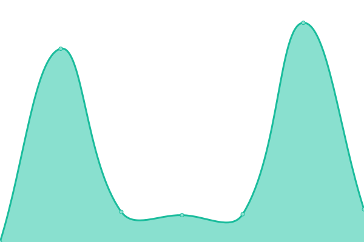
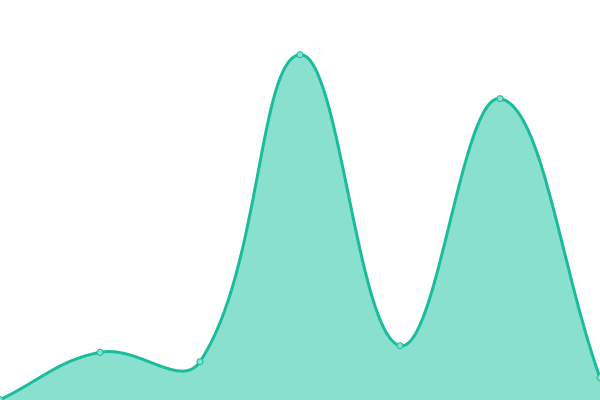
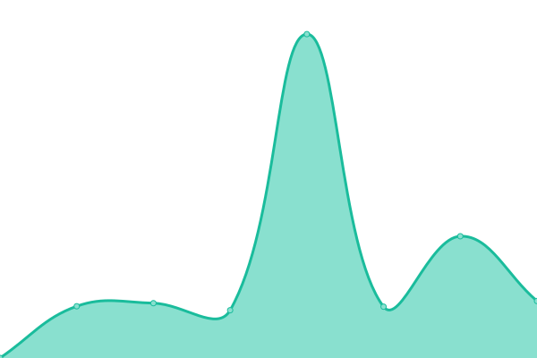

# [📈 Live Status](https://LukePrior.github.io/OpenBankingUptime): <!--live status--> **🟧 Partial outage**

This repository contains the open-source uptime monitor and status page for the [Australian Open Banking Data Database
](https://github.com/LukePrior/Australian-Open-Banking-Data-Database).

<!--start: status pages-->
<!-- This summary is generated by Upptime (https://github.com/upptime/upptime) -->
<!-- Do not edit this manually, your changes will be overwritten -->
<!-- prettier-ignore -->
| URL | Status | History | Response Time | Uptime |
| --- | ------ | ------- | ------------- | ------ |
|  [Australia and New Zealand Banking Group](https://api.anz/cds-au/v1/banking/products) | 🟩 Up | [australia-and-new-zealand-banking-group.yml](https://github.com/LukePrior/OpenBankingUptime/commits/HEAD/history/australia-and-new-zealand-banking-group.yml) | 

 709ms
     
 | 

<a href="https://LukePrior.github.io/OpenBankingUptime/history/australia-and-new-zealand-banking-group">100.00%</a>
    

|  [Commonwealth Bank of Australia](https://api.commbank.com.au/public/cds-au/v1/banking/products) | 🟩 Up | [commonwealth-bank-of-australia.yml](https://github.com/LukePrior/OpenBankingUptime/commits/HEAD/history/commonwealth-bank-of-australia.yml) | 

 1009ms
     
 | 

<a href="https://LukePrior.github.io/OpenBankingUptime/history/commonwealth-bank-of-australia">100.00%</a>
    

|  [National Australia Bank](https://openbank.api.nab.com.au/cds-au/v1/banking/products) | 🟩 Up | [national-australia-bank.yml](https://github.com/LukePrior/OpenBankingUptime/commits/HEAD/history/national-australia-bank.yml) | 

 1155ms
     
 | 

<a href="https://LukePrior.github.io/OpenBankingUptime/history/national-australia-bank">100.00%</a>
    

|  [Westpac Banking Corporation](https://digital-api.westpac.com.au/cds-au/v1/banking/products) | 🟩 Up | [westpac-banking-corporation.yml](https://github.com/LukePrior/OpenBankingUptime/commits/HEAD/history/westpac-banking-corporation.yml) | 

 4254ms
     
 | 

<a href="https://LukePrior.github.io/OpenBankingUptime/history/westpac-banking-corporation">100.00%</a>
    

|  [86 400](https://public.cdr-api.86400.com.au/cds-au/v1/banking/products) | 🟩 Up | [86-400.yml](https://github.com/LukePrior/OpenBankingUptime/commits/HEAD/history/86-400.yml) | 

 1056ms
     
 | 

<a href="https://LukePrior.github.io/OpenBankingUptime/history/86-400">100.00%</a>
    

|  [Adelaide Bank](https://api.cdr.adelaidebank.com.au/cds-au/v1/banking/products) | 🟩 Up | [adelaide-bank.yml](https://github.com/LukePrior/OpenBankingUptime/commits/HEAD/history/adelaide-bank.yml) | 

 1374ms
     
 | 

<a href="https://LukePrior.github.io/OpenBankingUptime/history/adelaide-bank">100.00%</a>
    

|  [AMP](https://api.cdr-api.amp.com.au/cds-au/v1/banking/products) | 🟩 Up | [amp.yml](https://github.com/LukePrior/OpenBankingUptime/commits/HEAD/history/amp.yml) | 

 1629ms
     
 | 

<a href="https://LukePrior.github.io/OpenBankingUptime/history/amp">100.00%</a>
    

|  [Arab Bank Australia](https://openbanking-api.arabbank.com.au/public/cds-au/v1/banking/products) | 🟩 Up | [arab-bank-australia.yml](https://github.com/LukePrior/OpenBankingUptime/commits/HEAD/history/arab-bank-australia.yml) | 

 1944ms
     
 | 

<a href="https://LukePrior.github.io/OpenBankingUptime/history/arab-bank-australia">100.00%</a>
    

|  [Australian Military Bank](https://public.open.australianmilitarybank.com.au/cds-au/v1/banking/products) | 🟩 Up | [australian-military-bank.yml](https://github.com/LukePrior/OpenBankingUptime/commits/HEAD/history/australian-military-bank.yml) | 

 1222ms
     
 | 

<a href="https://LukePrior.github.io/OpenBankingUptime/history/australian-military-bank">32.04%</a>
    

|  [Australian Mutual Bank](https://internetbanking.australianmutual.bank/openbanking/cds-au/v1/banking/products) | 🟩 Up | [australian-mutual-bank.yml](https://github.com/LukePrior/OpenBankingUptime/commits/HEAD/history/australian-mutual-bank.yml) | 

 1401ms
     
 | 

<a href="https://LukePrior.github.io/OpenBankingUptime/history/australian-mutual-bank">100.00%</a>
    

|  [Australian Unity Bank](https://open-banking.australianunity.com.au/cds-au/v1/banking/products) | 🟩 Up | [australian-unity-bank.yml](https://github.com/LukePrior/OpenBankingUptime/commits/HEAD/history/australian-unity-bank.yml) | 

 10363ms
     
 | 

<a href="https://LukePrior.github.io/OpenBankingUptime/history/australian-unity-bank">90.43%</a>
    

|  [Auswide Bank](https://api.auswidebank.com.au/OpenBanking/cds-au/v1/banking/products) | 🟩 Up | [auswide-bank.yml](https://github.com/LukePrior/OpenBankingUptime/commits/HEAD/history/auswide-bank.yml) | 

 2878ms
     
 | 

<a href="https://LukePrior.github.io/OpenBankingUptime/history/auswide-bank">100.00%</a>
    

|  [AWA Alliance Bank](https://api.cdr.awaalliancebank.com.au/cds-au/v1/banking/products) | 🟩 Up | [awa-alliance-bank.yml](https://github.com/LukePrior/OpenBankingUptime/commits/HEAD/history/awa-alliance-bank.yml) | 

 1353ms
     
 | 

<a href="https://LukePrior.github.io/OpenBankingUptime/history/awa-alliance-bank">75.00%</a>
    

|  [Bank Australia](https://cds.api.bankaust.com.au/cds-au/v1/banking/products) | 🟩 Up | [bank-australia.yml](https://github.com/LukePrior/OpenBankingUptime/commits/HEAD/history/bank-australia.yml) | 

 2931ms
     
 | 

<a href="https://LukePrior.github.io/OpenBankingUptime/history/bank-australia">60.52%</a>
    

|  [Bank First](https://public.cdr.bankfirst.com.au/cds-au/v1/banking/products) | 🟩 Up | [bank-first.yml](https://github.com/LukePrior/OpenBankingUptime/commits/HEAD/history/bank-first.yml) | 

 999ms
     
 | 

<a href="https://LukePrior.github.io/OpenBankingUptime/history/bank-first">60.52%</a>
    

|  [Bank of China Australia](https://obdevp.bank-of-china.net.au/cds-au/v1/banking/products) | 🟥 Down | [bank-of-china-australia.yml](https://github.com/LukePrior/OpenBankingUptime/commits/HEAD/history/bank-of-china-australia.yml) | 

 286ms
     
 | 

<a href="https://LukePrior.github.io/OpenBankingUptime/history/bank-of-china-australia">75.53%</a>
    

|  [Bank of Melbourne](https://digital-api.bankofmelbourne.com.au/cds-au/v1/banking/products) | 🟩 Up | [bank-of-melbourne.yml](https://github.com/LukePrior/OpenBankingUptime/commits/HEAD/history/bank-of-melbourne.yml) | 

 3763ms
     
 | 

<a href="https://LukePrior.github.io/OpenBankingUptime/history/bank-of-melbourne">100.00%</a>
    

|  [Bank of Sydney](https://openbank.api.banksyd.com.au/cds-au/v1/banking/products) | 🟩 Up | [bank-of-sydney.yml](https://github.com/LukePrior/OpenBankingUptime/commits/HEAD/history/bank-of-sydney.yml) | 

 1454ms
     
 | 

<a href="https://LukePrior.github.io/OpenBankingUptime/history/bank-of-sydney">100.00%</a>
    

|  [Bank of us](https://api.bankofus.com.au/OpenBanking/cds-au/v1/banking/products) | 🟩 Up | [bank-of-us.yml](https://github.com/LukePrior/OpenBankingUptime/commits/HEAD/history/bank-of-us.yml) | 

 1119ms
     
 | 

<a href="https://LukePrior.github.io/OpenBankingUptime/history/bank-of-us">75.67%</a>
    

|  [BankSA](https://digital-api.banksa.com.au/cds-au/v1/banking/products) | 🟩 Up | [bank-sa.yml](https://github.com/LukePrior/OpenBankingUptime/commits/HEAD/history/bank-sa.yml) | 

 4783ms
     
 | 

<a href="https://LukePrior.github.io/OpenBankingUptime/history/bank-sa">100.00%</a>
    

|  [BankVic](https://ib.bankvic.com.au/openbanking/cds-au/v1/banking/products) | 🟩 Up | [bank-vic.yml](https://github.com/LukePrior/OpenBankingUptime/commits/HEAD/history/bank-vic.yml) | 

 1051ms
     
 | 

<a href="https://LukePrior.github.io/OpenBankingUptime/history/bank-vic">100.00%</a>
    

|  [Bankwest](https://open-api.bankwest.com.au/bwpublic/cds-au/v1/banking/products) | 🟩 Up | [bankwest.yml](https://github.com/LukePrior/OpenBankingUptime/commits/HEAD/history/bankwest.yml) | 

 967ms
     
 | 

<a href="https://LukePrior.github.io/OpenBankingUptime/history/bankwest">100.00%</a>
    

|  [bcu](https://ob-api.bcu.com.au/cds-au/v1/banking/products) | 🟩 Up | [bcu.yml](https://github.com/LukePrior/OpenBankingUptime/commits/HEAD/history/bcu.yml) | 

 1162ms
     
 | 

<a href="https://LukePrior.github.io/OpenBankingUptime/history/bcu">99.06%</a>
    

|  [BDCU Alliance Bank](https://api.cdr.bdcualliancebank.com.au/cds-au/v1/banking/products) | 🟩 Up | [bdcu-alliance-bank.yml](https://github.com/LukePrior/OpenBankingUptime/commits/HEAD/history/bdcu-alliance-bank.yml) | 

 1105ms
     
 | 

<a href="https://LukePrior.github.io/OpenBankingUptime/history/bdcu-alliance-bank">100.00%</a>
    

|  [Bendigo Bank](https://api.cdr.bendigobank.com.au/cds-au/v1/banking/products) | 🟩 Up | [bendigo-bank.yml](https://github.com/LukePrior/OpenBankingUptime/commits/HEAD/history/bendigo-bank.yml) | 

 1195ms
     
 | 

<a href="https://LukePrior.github.io/OpenBankingUptime/history/bendigo-bank">99.84%</a>
    

|  [Beyond Bank Australia](https://public.cdr.api.beyondbank.com.au/cds-au/v1/banking/products) | 🟩 Up | [beyond-bank-australia.yml](https://github.com/LukePrior/OpenBankingUptime/commits/HEAD/history/beyond-bank-australia.yml) | 

 1048ms
     
 | 

<a href="https://LukePrior.github.io/OpenBankingUptime/history/beyond-bank-australia">100.00%</a>
    

|  [Bank of Queensland](https://secure.api.boq.com.au/cds-au/v1/banking/products) | 🟩 Up | [bank-of-queensland.yml](https://github.com/LukePrior/OpenBankingUptime/commits/HEAD/history/bank-of-queensland.yml) | 

 522ms
     
 | 

<a href="https://LukePrior.github.io/OpenBankingUptime/history/bank-of-queensland">100.00%</a>
    

|  [BOQ Specialist](https://secure.api.boqspecialist.com.au/cds-au/v1/banking/products) | 🟩 Up | [boq-specialist.yml](https://github.com/LukePrior/OpenBankingUptime/commits/HEAD/history/boq-specialist.yml) | 

 462ms
     
 | 

<a href="https://LukePrior.github.io/OpenBankingUptime/history/boq-specialist">100.00%</a>
    

|  [Broken Hill Community Credit Union](https://public.cdr-api.bhccu.com.au/cds-au/v1/banking/products) | 🟩 Up | [broken-hill-community-credit-union.yml](https://github.com/LukePrior/OpenBankingUptime/commits/HEAD/history/broken-hill-community-credit-union.yml) | 

 1769ms
     
 | 

<a href="https://LukePrior.github.io/OpenBankingUptime/history/broken-hill-community-credit-union">100.00%</a>
    

|  [Cairns Bank](https://ibanking.cairnsbank.com.au/openbanking-penny/cds-au/v1/banking/products) | 🟩 Up | [cairns-bank.yml](https://github.com/LukePrior/OpenBankingUptime/commits/HEAD/history/cairns-bank.yml) | 

 1542ms
     
 | 

<a href="https://LukePrior.github.io/OpenBankingUptime/history/cairns-bank">100.00%</a>
    

|  [The Capricornian](https://onlinebanking.capricornian.com.au/OpenBanking/cds-au/v1/banking/products) | 🟩 Up | [the-capricornian.yml](https://github.com/LukePrior/OpenBankingUptime/commits/HEAD/history/the-capricornian.yml) | 

 3175ms
     
 | 

<a href="https://LukePrior.github.io/OpenBankingUptime/history/the-capricornian">99.41%</a>
    

|  [Central Murray Credit Union](https://secure.cmcu.com.au/openbanking/cds-au/v1/banking/products) | 🟩 Up | [central-murray-credit-union.yml](https://github.com/LukePrior/OpenBankingUptime/commits/HEAD/history/central-murray-credit-union.yml) | 

 1302ms
     
 | 

<a href="https://LukePrior.github.io/OpenBankingUptime/history/central-murray-credit-union">100.00%</a>
    

|  [Central West Credit Union](https://ib.cwcu.com.au/openbanking/cds-au/v1/banking/products) | 🟩 Up | [central-west-credit-union.yml](https://github.com/LukePrior/OpenBankingUptime/commits/HEAD/history/central-west-credit-union.yml) | 

 4043ms
     
 | 

<a href="https://LukePrior.github.io/OpenBankingUptime/history/central-west-credit-union">100.00%</a>
    

|  [Circle Alliance Bank](https://api.cdr.circle.com.au/cds-au/v1/banking/products) | 🟩 Up | [circle-alliance-bank.yml](https://github.com/LukePrior/OpenBankingUptime/commits/HEAD/history/circle-alliance-bank.yml) | 

 1333ms
     
 | 

<a href="https://LukePrior.github.io/OpenBankingUptime/history/circle-alliance-bank">100.00%</a>
    

|  [Citibank](https://aspac.api.citi.com/gcb/cds-au/v1/banking/products) | 🟩 Up | [citibank.yml](https://github.com/LukePrior/OpenBankingUptime/commits/HEAD/history/citibank.yml) | 

 1287ms
     
 | 

<a href="https://LukePrior.github.io/OpenBankingUptime/history/citibank">100.00%</a>
    

|  [Coastline Credit Union](https://public.cdr-api.coastline.com.au/cds-au/v1/banking/products) | 🟩 Up | [coastline-credit-union.yml](https://github.com/LukePrior/OpenBankingUptime/commits/HEAD/history/coastline-credit-union.yml) | 

 1267ms
     
 | 

<a href="https://LukePrior.github.io/OpenBankingUptime/history/coastline-credit-union">100.00%</a>
    

|  [Community First Credit Union](https://netbank.communityfirst.com.au/cf-openbanking/cds-au/v1/banking/products) | 🟩 Up | [community-first-credit-union.yml](https://github.com/LukePrior/OpenBankingUptime/commits/HEAD/history/community-first-credit-union.yml) | 

 1247ms
     
 | 

<a href="https://LukePrior.github.io/OpenBankingUptime/history/community-first-credit-union">100.00%</a>
    

|  [Credit Union SA](https://openbanking.api.creditunionsa.com.au/cds-au/v1/banking/products) | 🟩 Up | [credit-union-sa.yml](https://github.com/LukePrior/OpenBankingUptime/commits/HEAD/history/credit-union-sa.yml) | 

 1015ms
     
 | 

<a href="https://LukePrior.github.io/OpenBankingUptime/history/credit-union-sa">100.00%</a>
    

|  [Defence Bank](https://product.defencebank.com.au/cds-au/v1/banking/products) | 🟩 Up | [defence-bank.yml](https://github.com/LukePrior/OpenBankingUptime/commits/HEAD/history/defence-bank.yml) | 

 1089ms
     
 | 

<a href="https://LukePrior.github.io/OpenBankingUptime/history/defence-bank">100.00%</a>
    

|  [Dnister Ukrainian Credit Co-operative](https://public.cdr-api.dnister.com.au/cds-au/v1/banking/products) | 🟩 Up | [dnister-ukrainian-credit-co-operative.yml](https://github.com/LukePrior/OpenBankingUptime/commits/HEAD/history/dnister-ukrainian-credit-co-operative.yml) | 

 865ms
     
 | 

<a href="https://LukePrior.github.io/OpenBankingUptime/history/dnister-ukrainian-credit-co-operative">100.00%</a>
    

|  [Easy Street Financial Services](https://ebranch.easystreet.com.au/es-openbanking/cds-au/v1/banking/products) | 🟩 Up | [easy-street-financial-services.yml](https://github.com/LukePrior/OpenBankingUptime/commits/HEAD/history/easy-street-financial-services.yml) | 

 1249ms
     
 | 

<a href="https://LukePrior.github.io/OpenBankingUptime/history/easy-street-financial-services">100.00%</a>
    

|  [Family First Credit Union](https://online.familyfirst.com.au/OpenBanking/cds-au/v1/banking/products) | 🟩 Up | [family-first-credit-union.yml](https://github.com/LukePrior/OpenBankingUptime/commits/HEAD/history/family-first-credit-union.yml) | 

 1157ms
     
 | 

<a href="https://LukePrior.github.io/OpenBankingUptime/history/family-first-credit-union">100.00%</a>
    

|  [Firefighters Mutual Bank](https://ob.tmbl.com.au/fmbank/cds-au/v1/banking/products) | 🟩 Up | [firefighters-mutual-bank.yml](https://github.com/LukePrior/OpenBankingUptime/commits/HEAD/history/firefighters-mutual-bank.yml) | 

 521ms
     
 | 

<a href="https://LukePrior.github.io/OpenBankingUptime/history/firefighters-mutual-bank">100.00%</a>
    

|  [Fire Service Credit Union](https://public.cdr-api.fscu.com.au/cds-au/v1/banking/products) | 🟩 Up | [fire-service-credit-union.yml](https://github.com/LukePrior/OpenBankingUptime/commits/HEAD/history/fire-service-credit-union.yml) | 

 1217ms
     
 | 

<a href="https://LukePrior.github.io/OpenBankingUptime/history/fire-service-credit-union">100.00%</a>
    

|  [First Choice Credit Union](https://public.cdr-api.firstchoicecu.com.au/cds-au/v1/banking/products) | 🟩 Up | [first-choice-credit-union.yml](https://github.com/LukePrior/OpenBankingUptime/commits/HEAD/history/first-choice-credit-union.yml) | 

 1351ms
     
 | 

<a href="https://LukePrior.github.io/OpenBankingUptime/history/first-choice-credit-union">100.00%</a>
    

|  [First Option Bank](https://internetbanking.firstoption.com.au/OpenBanking/cds-au/v1/banking/products) | 🟩 Up | [first-option-bank.yml](https://github.com/LukePrior/OpenBankingUptime/commits/HEAD/history/first-option-bank.yml) | 

 1436ms
     
 | 

<a href="https://LukePrior.github.io/OpenBankingUptime/history/first-option-bank">100.00%</a>
    

|  [G&C Mutual Bank](https://ibank.gcmutualbank.com.au/openbanking/cds-au/v1/banking/products) | 🟩 Up | [g-and-c-mutual-bank.yml](https://github.com/LukePrior/OpenBankingUptime/commits/HEAD/history/g-and-c-mutual-bank.yml) | 

 1101ms
     
 | 

<a href="https://LukePrior.github.io/OpenBankingUptime/history/g-and-c-mutual-bank">100.00%</a>
    

|  [Gateway Bank](https://public.cdr-api.gatewaybank.com.au/cds-au/v1/banking/products) | 🟩 Up | [gateway-bank.yml](https://github.com/LukePrior/OpenBankingUptime/commits/HEAD/history/gateway-bank.yml) | 

 954ms
     
 | 

<a href="https://LukePrior.github.io/OpenBankingUptime/history/gateway-bank">100.00%</a>
    

|  [Geelong Bank](https://online.geelongbank.com.au/OpenBanking/cds-au/v1/banking/products) | 🟩 Up | [geelong-bank.yml](https://github.com/LukePrior/OpenBankingUptime/commits/HEAD/history/geelong-bank.yml) | 

 1483ms
     
 | 

<a href="https://LukePrior.github.io/OpenBankingUptime/history/geelong-bank">100.00%</a>
    

|  [Goldfields Money](https://prd.bnk.com.au/cds-au/v1/banking/products) | 🟩 Up | [goldfields-money.yml](https://github.com/LukePrior/OpenBankingUptime/commits/HEAD/history/goldfields-money.yml) | 

 797ms
     
 | 

<a href="https://LukePrior.github.io/OpenBankingUptime/history/goldfields-money">100.00%</a>
    

|  [Goulburn Murray Credit Union](https://gmcu.cds.cuscal.com.au/cds-au/v1/banking/products) | 🟩 Up | [goulburn-murray-credit-union.yml](https://github.com/LukePrior/OpenBankingUptime/commits/HEAD/history/goulburn-murray-credit-union.yml) | 

 876ms
     
 | 

<a href="https://LukePrior.github.io/OpenBankingUptime/history/goulburn-murray-credit-union">100.00%</a>
    

|  [Great Southern Bank](https://api.open-banking.greatsouthernbank.com.au/cds-au/v1/banking/products) | 🟩 Up | [great-southern-bank.yml](https://github.com/LukePrior/OpenBankingUptime/commits/HEAD/history/great-southern-bank.yml) | 

 1562ms
     
 | 

<a href="https://LukePrior.github.io/OpenBankingUptime/history/great-southern-bank">100.00%</a>
    

|  [Greater Bank](https://public.cdr-api.greater.com.au/cds-au/v1/banking/products) | 🟩 Up | [greater-bank.yml](https://github.com/LukePrior/OpenBankingUptime/commits/HEAD/history/greater-bank.yml) | 

 1462ms
     
 | 

<a href="https://LukePrior.github.io/OpenBankingUptime/history/greater-bank">89.70%</a>
    

|  [Health Professionals Bank](https://ob.tmbl.com.au/hpbank/cds-au/v1/banking/products) | 🟩 Up | [health-professionals-bank.yml](https://github.com/LukePrior/OpenBankingUptime/commits/HEAD/history/health-professionals-bank.yml) | 

 413ms
     
 | 

<a href="https://LukePrior.github.io/OpenBankingUptime/history/health-professionals-bank">100.00%</a>
    

|  [Heritage Bank](https://product.api.heritage.com.au/cds-au/v1/banking/products) | 🟩 Up | [heritage-bank.yml](https://github.com/LukePrior/OpenBankingUptime/commits/HEAD/history/heritage-bank.yml) | 

 2026ms
     
 | 

<a href="https://LukePrior.github.io/OpenBankingUptime/history/heritage-bank">100.00%</a>
    

|  [Hiver Bank](https://ob.tmbl.com.au/hiver/cds-au/v1/banking/products) | 🟩 Up | [hiver-bank.yml](https://github.com/LukePrior/OpenBankingUptime/commits/HEAD/history/hiver-bank.yml) | 

 703ms
     
 | 

<a href="https://LukePrior.github.io/OpenBankingUptime/history/hiver-bank">100.00%</a>
    

|  [Horizon Bank](https://onlinebanking.horizonbank.com.au/openbanking/cds-au/v1/banking/products) | 🟩 Up | [horizon-bank.yml](https://github.com/LukePrior/OpenBankingUptime/commits/HEAD/history/horizon-bank.yml) | 

 1077ms
     
 | 

<a href="https://LukePrior.github.io/OpenBankingUptime/history/horizon-bank">100.00%</a>
    

|  [HSBC Bank](https://openbanking.hsbc.com.au/cds-au/v1/banking/products) | 🟩 Up | [hsbc-bank.yml](https://github.com/LukePrior/OpenBankingUptime/commits/HEAD/history/hsbc-bank.yml) | 

 1348ms
     
 | 

<a href="https://LukePrior.github.io/OpenBankingUptime/history/hsbc-bank">100.00%</a>
    

|  [Hume Bank](https://ibank.humebank.com.au/openbanking/cds-au/v1/banking/products) | 🟩 Up | [hume-bank.yml](https://github.com/LukePrior/OpenBankingUptime/commits/HEAD/history/hume-bank.yml) | 

 696ms
     
 | 

<a href="https://LukePrior.github.io/OpenBankingUptime/history/hume-bank">100.00%</a>
    

|  [Illawarra Credit Union](https://onlineteller.cu.com.au/OpenBanking/cds-au/v1/banking/products) | 🟩 Up | [illawarra-credit-union.yml](https://github.com/LukePrior/OpenBankingUptime/commits/HEAD/history/illawarra-credit-union.yml) | 

 1112ms
     
 | 

<a href="https://LukePrior.github.io/OpenBankingUptime/history/illawarra-credit-union">100.00%</a>
    

|  [IMB Bank](https://openbank.openbanking.imb.com.au/cds-au/v1/banking/products) | 🟩 Up | [imb-bank.yml](https://github.com/LukePrior/OpenBankingUptime/commits/HEAD/history/imb-bank.yml) | 

 1299ms
     
 | 

<a href="https://LukePrior.github.io/OpenBankingUptime/history/imb-bank">100.00%</a>
    

|  [ING Bank](https://apic.ing.com.au/cds-au/v1/banking/products) | 🟩 Up | [ing-bank.yml](https://github.com/LukePrior/OpenBankingUptime/commits/HEAD/history/ing-bank.yml) | 

 848ms
     
 | 

<a href="https://LukePrior.github.io/OpenBankingUptime/history/ing-bank">100.00%</a>
    

|  [Judo Bank](https://public.open.judo.bank/cds-au/v1/banking/products) | 🟩 Up | [judo-bank.yml](https://github.com/LukePrior/OpenBankingUptime/commits/HEAD/history/judo-bank.yml) | 

 882ms
     
 | 

<a href="https://LukePrior.github.io/OpenBankingUptime/history/judo-bank">100.00%</a>
    

|  [Laboratories Credit Union](https://internetbanking.lcu.com.au/openbanking/cds-au/v1/banking/products) | 🟩 Up | [laboratories-credit-union.yml](https://github.com/LukePrior/OpenBankingUptime/commits/HEAD/history/laboratories-credit-union.yml) | 

 1066ms
     
 | 

<a href="https://LukePrior.github.io/OpenBankingUptime/history/laboratories-credit-union">100.00%</a>
    

|  [Leveraged](https://api.cdr.leveraged.com.au/cds-au/v1/banking/products) | 🟩 Up | [leveraged.yml](https://github.com/LukePrior/OpenBankingUptime/commits/HEAD/history/leveraged.yml) | 

 981ms
     
 | 

<a href="https://LukePrior.github.io/OpenBankingUptime/history/leveraged">100.00%</a>
    

|  [Macquarie Bank](https://api.macquariebank.io/cds-au/v1/banking/products) | 🟩 Up | [macquarie-bank.yml](https://github.com/LukePrior/OpenBankingUptime/commits/HEAD/history/macquarie-bank.yml) | 

 704ms
     
 | 

<a href="https://LukePrior.github.io/OpenBankingUptime/history/macquarie-bank">100.00%</a>
    

|  [Macquarie Credit Union](https://banking.macquariecu.com.au/OpenBanking/cds-au/v1/banking/products) | 🟩 Up | [macquarie-credit-union.yml](https://github.com/LukePrior/OpenBankingUptime/commits/HEAD/history/macquarie-credit-union.yml) | 

 8409ms
     
 | 

<a href="https://LukePrior.github.io/OpenBankingUptime/history/macquarie-credit-union">85.19%</a>
    

|  [ME Bank](https://api.mebank.com.au/cds-au/v1/banking/products) | 🟩 Up | [me-bank.yml](https://github.com/LukePrior/OpenBankingUptime/commits/HEAD/history/me-bank.yml) | 

 1049ms
     
 | 

<a href="https://LukePrior.github.io/OpenBankingUptime/history/me-bank">100.00%</a>
    

|  [MOVE Bank](https://api.movebank.com.au/OpenBanking/cds-au/v1/banking/products) | 🟩 Up | [move-bank.yml](https://github.com/LukePrior/OpenBankingUptime/commits/HEAD/history/move-bank.yml) | 

 6345ms
     
 | 

<a href="https://LukePrior.github.io/OpenBankingUptime/history/move-bank">65.79%</a>
    

|  [Money by Afterpay](https://api.cds.afterpay.com.au/cds-au/v1/banking/products) | 🟩 Up | [money-by-afterpay.yml](https://github.com/LukePrior/OpenBankingUptime/commits/HEAD/history/money-by-afterpay.yml) | 

 843ms
     
 | 

<a href="https://LukePrior.github.io/OpenBankingUptime/history/money-by-afterpay">100.00%</a>
    

|  [The Mutual Bank](https://openbanking.themutual.com.au/OpenBanking/cds-au/v1/banking/products) | 🟩 Up | [the-mutual-bank.yml](https://github.com/LukePrior/OpenBankingUptime/commits/HEAD/history/the-mutual-bank.yml) | 

 9037ms
     
 | 

<a href="https://LukePrior.github.io/OpenBankingUptime/history/the-mutual-bank">97.80%</a>
    

|  [MyLife MyFinance](https://openbanking-api.mylifemyfinance.com.au/cds-au/v1/banking/products) | 🟩 Up | [my-life-my-finance.yml](https://github.com/LukePrior/OpenBankingUptime/commits/HEAD/history/my-life-my-finance.yml) | 

 854ms
     
 | 

<a href="https://LukePrior.github.io/OpenBankingUptime/history/my-life-my-finance">100.00%</a>
    

|  [MyState Bank](https://openbank.api.mystate.com.au/cds-au/v1/banking/products) | 🟩 Up | [my-state-bank.yml](https://github.com/LukePrior/OpenBankingUptime/commits/HEAD/history/my-state-bank.yml) | 

 1007ms
     
 | 

<a href="https://LukePrior.github.io/OpenBankingUptime/history/my-state-bank">100.00%</a>
    

|  [Newcastle Permanent Building Society](https://api.newcastlepermanent.com.au/cds-au/v1/banking/products) | 🟩 Up | [newcastle-permanent-building-society.yml](https://github.com/LukePrior/OpenBankingUptime/commits/HEAD/history/newcastle-permanent-building-society.yml) | 

 2965ms
     
 | 

<a href="https://LukePrior.github.io/OpenBankingUptime/history/newcastle-permanent-building-society">100.00%</a>
    

|  [Northern Inland Credit Union](https://api.cds.nicu.com.au/cds-au/v1/banking/products) | 🟩 Up | [northern-inland-credit-union.yml](https://github.com/LukePrior/OpenBankingUptime/commits/HEAD/history/northern-inland-credit-union.yml) | 

 3853ms
     
 | 

<a href="https://LukePrior.github.io/OpenBankingUptime/history/northern-inland-credit-union">100.00%</a>
    

|  [Nova Alliance Bank](https://api.cdr.novaalliancebank.com.au/cds-au/v1/banking/products) | 🟩 Up | [nova-alliance-bank.yml](https://github.com/LukePrior/OpenBankingUptime/commits/HEAD/history/nova-alliance-bank.yml) | 

 811ms
     
 | 

<a href="https://LukePrior.github.io/OpenBankingUptime/history/nova-alliance-bank">100.00%</a>
    

|  [Orange Credit Union](https://online.orangecu.com.au/openbanking/cds-au/v1/banking/products) | 🟩 Up | [orange-credit-union.yml](https://github.com/LukePrior/OpenBankingUptime/commits/HEAD/history/orange-credit-union.yml) | 

 1093ms
     
 | 

<a href="https://LukePrior.github.io/OpenBankingUptime/history/orange-credit-union">100.00%</a>
    

|  [PayPal](https://api.paypal.com/v1/identity/cds-au/v1/banking/products) | 🟩 Up | [pay-pal.yml](https://github.com/LukePrior/OpenBankingUptime/commits/HEAD/history/pay-pal.yml) | 

 225ms
     
 | 

<a href="https://LukePrior.github.io/OpenBankingUptime/history/pay-pal">100.00%</a>
    

|  [Peoples Choice Credit Union](https://api.peopleschoice.com.au/public/cds-au/v1/banking/products) | 🟩 Up | [peoples-choice-credit-union.yml](https://github.com/LukePrior/OpenBankingUptime/commits/HEAD/history/peoples-choice-credit-union.yml) | 

 1156ms
     
 | 

<a href="https://LukePrior.github.io/OpenBankingUptime/history/peoples-choice-credit-union">100.00%</a>
    

|  [Police Bank](https://product.api.policebank.com.au/cds-au/v1/banking/products) | 🟩 Up | [police-bank.yml](https://github.com/LukePrior/OpenBankingUptime/commits/HEAD/history/police-bank.yml) | 

 1080ms
     
 | 

<a href="https://LukePrior.github.io/OpenBankingUptime/history/police-bank">100.00%</a>
    

|  [Police Credit Union](https://api.policecu.com.au/openbanking/cds-au/v1/banking/products) | 🟩 Up | [police-credit-union.yml](https://github.com/LukePrior/OpenBankingUptime/commits/HEAD/history/police-credit-union.yml) | 

 1196ms
     
 | 

<a href="https://LukePrior.github.io/OpenBankingUptime/history/police-credit-union">100.00%</a>
    

|  [P&N Bank](https://ob-api.pnbank.com.au/cds-au/v1/banking/products) | 🟩 Up | [p-and-n-bank.yml](https://github.com/LukePrior/OpenBankingUptime/commits/HEAD/history/p-and-n-bank.yml) | 

 1104ms
     
 | 

<a href="https://LukePrior.github.io/OpenBankingUptime/history/p-and-n-bank">99.07%</a>
    

|  [QBANK](https://banking.qbank.com.au/openbanking/cds-au/v1/banking/products) | 🟩 Up | [qbank.yml](https://github.com/LukePrior/OpenBankingUptime/commits/HEAD/history/qbank.yml) | 

 1091ms
     
 | 

<a href="https://LukePrior.github.io/OpenBankingUptime/history/qbank">100.00%</a>
    

|  [Qudos Bank](https://public.cdr-api.qudosbank.com.au/cds-au/v1/banking/products) | 🟩 Up | [qudos-bank.yml](https://github.com/LukePrior/OpenBankingUptime/commits/HEAD/history/qudos-bank.yml) | 

 11087ms
     
 | 

<a href="https://LukePrior.github.io/OpenBankingUptime/history/qudos-bank">100.00%</a>
    

|  [Queensland Country Bank](https://public.cdr-api.queenslandcountry.bank/cds-au/v1/banking/products) | 🟩 Up | [queensland-country-bank.yml](https://github.com/LukePrior/OpenBankingUptime/commits/HEAD/history/queensland-country-bank.yml) | 

 1091ms
     
 | 

<a href="https://LukePrior.github.io/OpenBankingUptime/history/queensland-country-bank">100.00%</a>
    

|  [Rabobank](https://openbanking.api.rabobank.com.au/cds-au/v1/banking/products) | 🟩 Up | [rabobank.yml](https://github.com/LukePrior/OpenBankingUptime/commits/HEAD/history/rabobank.yml) | 

 738ms
     
 | 

<a href="https://LukePrior.github.io/OpenBankingUptime/history/rabobank">100.00%</a>
    

|  [RACQ Bank](https://cdrbank.racq.com.au/cds-au/v1/banking/products) | 🟩 Up | [racq-bank.yml](https://github.com/LukePrior/OpenBankingUptime/commits/HEAD/history/racq-bank.yml) | 

 2354ms
     
 | 

<a href="https://LukePrior.github.io/OpenBankingUptime/history/racq-bank">100.00%</a>
    

|  [RAMS Financial Group](https://digital-api.westpac.com.au/rams/cds-au/v1/banking/products) | 🟩 Up | [rams-financial-group.yml](https://github.com/LukePrior/OpenBankingUptime/commits/HEAD/history/rams-financial-group.yml) | 

 3558ms
     
 | 

<a href="https://LukePrior.github.io/OpenBankingUptime/history/rams-financial-group">100.00%</a>
    

|  [Regional Australia Bank](https://public-data.cdr.regaustbank.io/cds-au/v1/banking/products) | 🟩 Up | [regional-australia-bank.yml](https://github.com/LukePrior/OpenBankingUptime/commits/HEAD/history/regional-australia-bank.yml) | 

 480ms
     
 | 

<a href="https://LukePrior.github.io/OpenBankingUptime/history/regional-australia-bank">45.01%</a>
    

|  [RSL Money](https://public.open.rslmoney.com.au/cds-au/v1/banking/products) | 🟩 Up | [rsl-money.yml](https://github.com/LukePrior/OpenBankingUptime/commits/HEAD/history/rsl-money.yml) | 

 909ms
     
 | 

<a href="https://LukePrior.github.io/OpenBankingUptime/history/rsl-money">100.00%</a>
    

|  [Rural Bank](https://api.cdr.ruralbank.com.au/cds-au/v1/banking/products) | 🟩 Up | [rural-bank.yml](https://github.com/LukePrior/OpenBankingUptime/commits/HEAD/history/rural-bank.yml) | 

 1233ms
     
 | 

<a href="https://LukePrior.github.io/OpenBankingUptime/history/rural-bank">100.00%</a>
    

|  [Service One Alliance Bank](https://api.cdr.serviceone.com.au/cds-au/v1/banking/products) | 🟩 Up | [service-one-alliance-bank.yml](https://github.com/LukePrior/OpenBankingUptime/commits/HEAD/history/service-one-alliance-bank.yml) | 

 1009ms
     
 | 

<a href="https://LukePrior.github.io/OpenBankingUptime/history/service-one-alliance-bank">100.00%</a>
    

|  [South West Credit Union](https://internetbanking.swcredit.com.au/OpenBanking/cds-au/v1/banking/products) | 🟩 Up | [south-west-credit-union.yml](https://github.com/LukePrior/OpenBankingUptime/commits/HEAD/history/south-west-credit-union.yml) | 

 1217ms
     
 | 

<a href="https://LukePrior.github.io/OpenBankingUptime/history/south-west-credit-union">100.00%</a>
    

|  [South West Slopes Credit Union](https://online.swscu.com.au/OpenBanking/cds-au/v1/banking/products) | 🟩 Up | [south-west-slopes-credit-union.yml](https://github.com/LukePrior/OpenBankingUptime/commits/HEAD/history/south-west-slopes-credit-union.yml) | 

 4904ms
     
 | 

<a href="https://LukePrior.github.io/OpenBankingUptime/history/south-west-slopes-credit-union">100.00%</a>
    

|  [Southern Cross Credit Union](https://mvp1.sccu.com.au/OpenBanking/cds-au/v1/banking/products) | 🟩 Up | [southern-cross-credit-union.yml](https://github.com/LukePrior/OpenBankingUptime/commits/HEAD/history/southern-cross-credit-union.yml) | 

 1716ms
     
 | 

<a href="https://LukePrior.github.io/OpenBankingUptime/history/southern-cross-credit-union">100.00%</a>
    

|  [St.George Bank](https://digital-api.stgeorge.com.au/cds-au/v1/banking/products) | 🟩 Up | [st-george-bank.yml](https://github.com/LukePrior/OpenBankingUptime/commits/HEAD/history/st-george-bank.yml) | 

 3598ms
     
 | 

<a href="https://LukePrior.github.io/OpenBankingUptime/history/st-george-bank">100.00%</a>
    

|  [Summerland Credit Union](https://public.cdr-api.summerland.com.au/cds-au/v1/banking/products) | 🟩 Up | [summerland-credit-union.yml](https://github.com/LukePrior/OpenBankingUptime/commits/HEAD/history/summerland-credit-union.yml) | 

 1155ms
     
 | 

<a href="https://LukePrior.github.io/OpenBankingUptime/history/summerland-credit-union">100.00%</a>
    

|  [Suncorp](https://prd.suncorpbank.com.au/cds-au/v1/banking/products) | 🟩 Up | [suncorp.yml](https://github.com/LukePrior/OpenBankingUptime/commits/HEAD/history/suncorp.yml) | 

 1052ms
     
 | 

<a href="https://LukePrior.github.io/OpenBankingUptime/history/suncorp">100.00%</a>
    

|  [Teachers Mutual Bank](https://ob.tmbl.com.au/tmbank/cds-au/v1/banking/products) | 🟩 Up | [teachers-mutual-bank.yml](https://github.com/LukePrior/OpenBankingUptime/commits/HEAD/history/teachers-mutual-bank.yml) | 

 606ms
     
 | 

<a href="https://LukePrior.github.io/OpenBankingUptime/history/teachers-mutual-bank">100.00%</a>
    

|  [The Mac Credit Union](https://onlinebanking.themaccu.com.au/OpenBanking/cds-au/v1/banking/products) | 🟩 Up | [the-mac-credit-union.yml](https://github.com/LukePrior/OpenBankingUptime/commits/HEAD/history/the-mac-credit-union.yml) | 

 1153ms
     
 | 

<a href="https://LukePrior.github.io/OpenBankingUptime/history/the-mac-credit-union">100.00%</a>
    

|  [Traditional Credit Union](https://prd.tcu.com.au/cds-au/v1/banking/products) | 🟩 Up | [traditional-credit-union.yml](https://github.com/LukePrior/OpenBankingUptime/commits/HEAD/history/traditional-credit-union.yml) | 

 1052ms
     
 | 

<a href="https://LukePrior.github.io/OpenBankingUptime/history/traditional-credit-union">100.00%</a>
    

|  [Transport Mutual Credit Union](https://banking.transportmutual.com.au/OpenBanking/cds-au/v1/banking/products) | 🟩 Up | [transport-mutual-credit-union.yml](https://github.com/LukePrior/OpenBankingUptime/commits/HEAD/history/transport-mutual-credit-union.yml) | 

 1056ms
     
 | 

<a href="https://LukePrior.github.io/OpenBankingUptime/history/transport-mutual-credit-union">100.00%</a>
    

|  [Tyro](https://public.cdr.tyro.com/cds-au/v1/banking/products) | 🟩 Up | [tyro.yml](https://github.com/LukePrior/OpenBankingUptime/commits/HEAD/history/tyro.yml) | 

 918ms
     
 | 

<a href="https://LukePrior.github.io/OpenBankingUptime/history/tyro">100.00%</a>
    

|  [UBank](https://openbank.api.ubank.com.au/cds-au/v1/banking/products) | 🟩 Up | [u-bank.yml](https://github.com/LukePrior/OpenBankingUptime/commits/HEAD/history/u-bank.yml) | 

 1090ms
     
 | 

<a href="https://LukePrior.github.io/OpenBankingUptime/history/u-bank">100.00%</a>
    

|  [Unibank](https://ob.tmbl.com.au/unibank/cds-au/v1/banking/products) | 🟩 Up | [unibank.yml](https://github.com/LukePrior/OpenBankingUptime/commits/HEAD/history/unibank.yml) | 

 391ms
     
 | 

<a href="https://LukePrior.github.io/OpenBankingUptime/history/unibank">100.00%</a>
    

|  [Unity Bank](https://ibanking.unitybank.com.au/OpenBanking/cds-au/v1/banking/products) | 🟩 Up | [unity-bank.yml](https://github.com/LukePrior/OpenBankingUptime/commits/HEAD/history/unity-bank.yml) | 

 1177ms
     
 | 

<a href="https://LukePrior.github.io/OpenBankingUptime/history/unity-bank">100.00%</a>
    

|  [Up](https://api.up.com.au/cds-au/v1/banking/products) | 🟩 Up | [up.yml](https://github.com/LukePrior/OpenBankingUptime/commits/HEAD/history/up.yml) | 

 239ms
     
 | 

<a href="https://LukePrior.github.io/OpenBankingUptime/history/up">100.00%</a>
    

|  [Virgin Money Australia](https://secure.api.virginmoney.com.au/cds-au/v1/banking/products) | 🟩 Up | [virgin-money-australia.yml](https://github.com/LukePrior/OpenBankingUptime/commits/HEAD/history/virgin-money-australia.yml) | 

 581ms
     
 | 

<a href="https://LukePrior.github.io/OpenBankingUptime/history/virgin-money-australia">100.00%</a>
    

|  [Volt Bank](https://api.voltbank.com.au/cds-au/v1/banking/products) | 🟩 Up | [volt-bank.yml](https://github.com/LukePrior/OpenBankingUptime/commits/HEAD/history/volt-bank.yml) | 

 1144ms
     
 | 

<a href="https://LukePrior.github.io/OpenBankingUptime/history/volt-bank">100.00%</a>
    

|  [Warwick Credit Union](https://ibanking.wcu.com.au/openbanking-warwick/cds-au/v1/banking/products) | 🟩 Up | [warwick-credit-union.yml](https://github.com/LukePrior/OpenBankingUptime/commits/HEAD/history/warwick-credit-union.yml) | 

 1349ms
     
 | 

<a href="https://LukePrior.github.io/OpenBankingUptime/history/warwick-credit-union">100.00%</a>
    

|  [WAW Credit Union](https://onlinebanking.wawcu.com.au/OpenBanking/cds-au/v1/banking/products) | 🟩 Up | [waw-credit-union.yml](https://github.com/LukePrior/OpenBankingUptime/commits/HEAD/history/waw-credit-union.yml) | 

 1344ms
     
 | 

<a href="https://LukePrior.github.io/OpenBankingUptime/history/waw-credit-union">100.00%</a>
    

|  [Woolworths Team Bank](https://online.woolworthsteambank.com.au/OpenBanking/cds-au/v1/banking/products) | 🟩 Up | [woolworths-team-bank.yml](https://github.com/LukePrior/OpenBankingUptime/commits/HEAD/history/woolworths-team-bank.yml) | 

 1524ms
     
 | 

<a href="https://LukePrior.github.io/OpenBankingUptime/history/woolworths-team-bank">58.61%</a>
    

|  [Consumer Data Right Register](https://api.cdr.gov.au/cdr-register/v1/banking/register) | 🟩 Up | [consumer-data-right-register.yml](https://github.com/LukePrior/OpenBankingUptime/commits/HEAD/history/consumer-data-right-register.yml) | 

 927ms
     
 | 

<a href="https://LukePrior.github.io/OpenBankingUptime/history/consumer-data-right-register">100.00%</a>
    

<!--end: status pages-->

[**Visit our status website →**](https://LukePrior.github.io/OpenBankingUptime)

## 📄 License

- Powered by: [Upptime](https://github.com/upptime/upptime)
- Code: [MIT](./LICENSE) © [Luke Prior](https://LukePrior.github.io/OpenBankingUptime)
- Data in the `./history` directory: [Open Database License](https://opendatacommons.org/licenses/odbl/1-0/)
