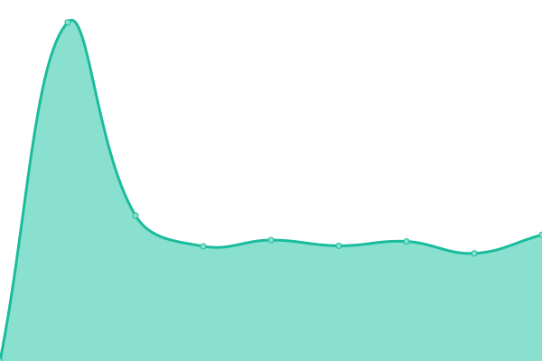
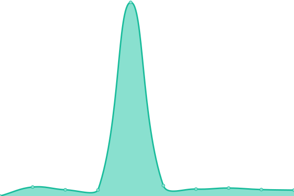
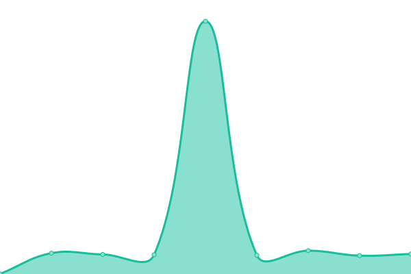
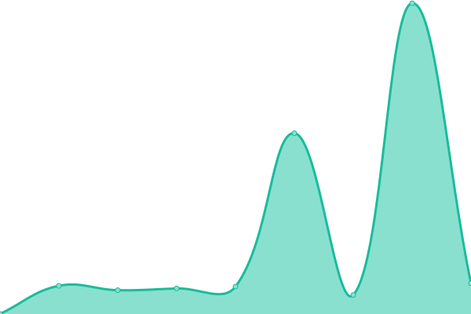
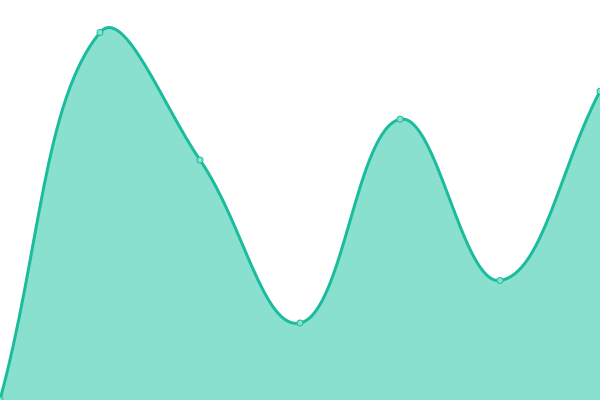

# [📈 Live Status](https://LukePrior.github.io/OpenBankingUptime): <!--live status--> **🟧 Partial outage**

This repository contains the open-source uptime monitor and status page for the [Australian Open Banking Data Database
](https://github.com/LukePrior/Australian-Open-Banking-Data-Database), powered by [Upptime](https://github.com/upptime/upptime).

<!--start: status pages-->
<!-- This summary is generated by Upptime (https://github.com/upptime/upptime) -->
<!-- Do not edit this manually, your changes will be overwritten -->
<!-- prettier-ignore -->
| URL | Status | History | Response Time | Uptime |
| --- | ------ | ------- | ------------- | ------ |
|  [Commonwealth Bank of Australia (CBA)](https://api.commbank.com.au/public/cds-au/v1/banking/products) | 🟩 Up | [commonwealth-bank-of-australia-cba.yml](https://github.com/LukePrior/OpenBankingUptime/commits/HEAD/history/commonwealth-bank-of-australia-cba.yml) | 

 1621ms
     
 | 

<a href="https://LukePrior.github.io/OpenBankingUptime/history/commonwealth-bank-of-australia-cba">100.00%</a>
    

|  [Westpac Banking Corporation (Westpac)](https://digital-api.westpac.com.au/cds-au/v1/banking/products) | 🟩 Up | [westpac-banking-corporation-westpac.yml](https://github.com/LukePrior/OpenBankingUptime/commits/HEAD/history/westpac-banking-corporation-westpac.yml) | 

 5860ms
     
 | 

<a href="https://LukePrior.github.io/OpenBankingUptime/history/westpac-banking-corporation-westpac">100.00%</a>
    

|  [Australia and New Zealand Banking Group (ANZ)](https://api.anz/cds-au/v1/banking/products) | 🟩 Up | [australia-and-new-zealand-banking-group-anz.yml](https://github.com/LukePrior/OpenBankingUptime/commits/HEAD/history/australia-and-new-zealand-banking-group-anz.yml) | 

 1655ms
     
 | 

<a href="https://LukePrior.github.io/OpenBankingUptime/history/australia-and-new-zealand-banking-group-anz">100.00%</a>
    

|  [National Australia Bank (NAB)](https://openbank.api.nab.com.au/cds-au/v1/banking/products) | 🟩 Up | [national-australia-bank-nab.yml](https://github.com/LukePrior/OpenBankingUptime/commits/HEAD/history/national-australia-bank-nab.yml) | 

 1598ms
     
 | 

<a href="https://LukePrior.github.io/OpenBankingUptime/history/national-australia-bank-nab">100.00%</a>
    

|  [Bank of Queensland (BOQ)](https://secure.api.boq.com.au/cds-au/v1/banking/products) | 🟩 Up | [bank-of-queensland-boq.yml](https://github.com/LukePrior/OpenBankingUptime/commits/HEAD/history/bank-of-queensland-boq.yml) | 

 473ms
     
 | 

<a href="https://LukePrior.github.io/OpenBankingUptime/history/bank-of-queensland-boq">100.00%</a>
    

|  [Macquarie Bank](https://api.cdr.bendigobank.com.au/cds-au/v1/banking/products) | 🟩 Up | [macquarie-bank.yml](https://github.com/LukePrior/OpenBankingUptime/commits/HEAD/history/macquarie-bank.yml) | 

 1069ms
     
 | 

<a href="https://LukePrior.github.io/OpenBankingUptime/history/macquarie-bank">100.00%</a>
    

|  [Bendigo Bank](https://api.anz/cds-au/v1/banking/products) | 🟩 Up | [bendigo-bank.yml](https://github.com/LukePrior/OpenBankingUptime/commits/HEAD/history/bendigo-bank.yml) | 

 116ms
     
 | 

<a href="https://LukePrior.github.io/OpenBankingUptime/history/bendigo-bank">100.00%</a>
    

|  [Adelaide Bank](https://api.cdr.adelaidebank.com.au/cds-au/v1/banking/products) | 🟩 Up | [adelaide-bank.yml](https://github.com/LukePrior/OpenBankingUptime/commits/HEAD/history/adelaide-bank.yml) | 

 1172ms
     
 | 

<a href="https://LukePrior.github.io/OpenBankingUptime/history/adelaide-bank">100.00%</a>
    

|  [AMP](https://api.cdr-api.amp.com.au/cds-au/v1/banking/products) | 🟩 Up | [amp.yml](https://github.com/LukePrior/OpenBankingUptime/commits/HEAD/history/amp.yml) | 

 1301ms
     
 | 

<a href="https://LukePrior.github.io/OpenBankingUptime/history/amp">100.00%</a>
    

|  [Suncorp](https://prd.suncorpbank.com.au/cds-au/v1/banking/products) | 🟩 Up | [suncorp.yml](https://github.com/LukePrior/OpenBankingUptime/commits/HEAD/history/suncorp.yml) | 

 1036ms
     
 | 

<a href="https://LukePrior.github.io/OpenBankingUptime/history/suncorp">100.00%</a>
    

|  [ING Bank](https://apic.ing.com.au/cds-au/v1/banking/products) | 🟩 Up | [ing-bank.yml](https://github.com/LukePrior/OpenBankingUptime/commits/HEAD/history/ing-bank.yml) | 

 908ms
     
 | 

<a href="https://LukePrior.github.io/OpenBankingUptime/history/ing-bank">100.00%</a>
    

|  [HSBC Bank](https://api.hsbc.com.au/cds-au/v1/banking/products) | 🟩 Up | [hsbc-bank.yml](https://github.com/LukePrior/OpenBankingUptime/commits/HEAD/history/hsbc-bank.yml) | 

 1151ms
     
 | 

<a href="https://LukePrior.github.io/OpenBankingUptime/history/hsbc-bank">100.00%</a>
    

|  [AWA Alliance Bank](https://api.cdr.awaalliancebank.com.au/cds-au/v1/banking/products) | 🟩 Up | [awa-alliance-bank.yml](https://github.com/LukePrior/OpenBankingUptime/commits/HEAD/history/awa-alliance-bank.yml) | 

 1366ms
     
 | 

<a href="https://LukePrior.github.io/OpenBankingUptime/history/awa-alliance-bank">100.00%</a>
    

|  [Arab Bank Australia](https://openbanking-api.arabbank.com.au/public/cds-au/v1/banking/products) | 🟩 Up | [arab-bank-australia.yml](https://github.com/LukePrior/OpenBankingUptime/commits/HEAD/history/arab-bank-australia.yml) | 

 1744ms
     
 | 

<a href="https://LukePrior.github.io/OpenBankingUptime/history/arab-bank-australia">100.00%</a>
    

|  [Australian Unity Bank](https://open-banking.australianunity.com.au/cds-au/v1/banking/products) | 🟩 Up | [australian-unity-bank.yml](https://github.com/LukePrior/OpenBankingUptime/commits/HEAD/history/australian-unity-bank.yml) | 

 9267ms
     
 | 

<a href="https://LukePrior.github.io/OpenBankingUptime/history/australian-unity-bank">100.00%</a>
    

|  [Auswide Bank](https://api.auswidebank.com.au/OpenBanking/cds-au/v1/banking/products) | 🟩 Up | [auswide-bank.yml](https://github.com/LukePrior/OpenBankingUptime/commits/HEAD/history/auswide-bank.yml) | 

 1310ms
     
 | 

<a href="https://LukePrior.github.io/OpenBankingUptime/history/auswide-bank">100.00%</a>
    

|  [BDCU Alliance Bank](https://api.cdr.bdcualliancebank.com.au/cds-au/v1/banking/products) | 🟩 Up | [bdcu-alliance-bank.yml](https://github.com/LukePrior/OpenBankingUptime/commits/HEAD/history/bdcu-alliance-bank.yml) | 

 908ms
     
 | 

<a href="https://LukePrior.github.io/OpenBankingUptime/history/bdcu-alliance-bank">100.00%</a>
    

|  [Bank Australia](https://cds.api.bankaust.com.au/cds-au/v1/banking/products) | 🟩 Up | [bank-australia.yml](https://github.com/LukePrior/OpenBankingUptime/commits/HEAD/history/bank-australia.yml) | 

 1745ms
     
 | 

<a href="https://LukePrior.github.io/OpenBankingUptime/history/bank-australia">100.00%</a>
    

|  [Bank of China Australia](https://obdevp.bank-of-china.net.au/cds-au/v1/banking/products) | 🟩 Up | [bank-of-china-australia.yml](https://github.com/LukePrior/OpenBankingUptime/commits/HEAD/history/bank-of-china-australia.yml) | 

 899ms
     
 | 

<a href="https://LukePrior.github.io/OpenBankingUptime/history/bank-of-china-australia">100.00%</a>
    

|  [Bank of Sydney](https://openbank.api.banksyd.com.au/cds-au/v1/banking/products) | 🟩 Up | [bank-of-sydney.yml](https://github.com/LukePrior/OpenBankingUptime/commits/HEAD/history/bank-of-sydney.yml) | 

 1351ms
     
 | 

<a href="https://LukePrior.github.io/OpenBankingUptime/history/bank-of-sydney">100.00%</a>
    

|  [Bankwest](https://open-api.bankwest.com.au/bwpublic/cds-au/v1/banking/products) | 🟩 Up | [bankwest.yml](https://github.com/LukePrior/OpenBankingUptime/commits/HEAD/history/bankwest.yml) | 

 5572ms
     
 | 

<a href="https://LukePrior.github.io/OpenBankingUptime/history/bankwest">100.00%</a>
    

|  [Beyond Bank Australia](https://public.cdr.api.beyondbank.com.au/cds-au/v1/banking/products) | 🟩 Up | [beyond-bank-australia.yml](https://github.com/LukePrior/OpenBankingUptime/commits/HEAD/history/beyond-bank-australia.yml) | 

 1639ms
     
 | 

<a href="https://LukePrior.github.io/OpenBankingUptime/history/beyond-bank-australia">100.00%</a>
    

|  [Cairns Bank](https://ibanking.cairnsbank.com.au/openbanking-penny/cds-au/v1/banking/products) | 🟥 Down | [cairns-bank.yml](https://github.com/LukePrior/OpenBankingUptime/commits/HEAD/history/cairns-bank.yml) | 

 982ms
     
 | 

<a href="https://LukePrior.github.io/OpenBankingUptime/history/cairns-bank">0.05%</a>
    

|  [Circle Alliance Bank](https://api.cdr.circle.com.au/cds-au/v1/banking/products) | 🟩 Up | [circle-alliance-bank.yml](https://github.com/LukePrior/OpenBankingUptime/commits/HEAD/history/circle-alliance-bank.yml) | 

 943ms
     
 | 

<a href="https://LukePrior.github.io/OpenBankingUptime/history/circle-alliance-bank">100.00%</a>
    

|  [Citibank](https://aspac.api.citi.com/gcb/cds-au/v1/banking/products) | 🟥 Down | [citibank.yml](https://github.com/LukePrior/OpenBankingUptime/commits/HEAD/history/citibank.yml) | 

 1008ms
     
 | 

<a href="https://LukePrior.github.io/OpenBankingUptime/history/citibank">1.69%</a>
    

|  [Delphi Bank](https://api.cdr.delphibank.com.au/cds-au/v1/banking/products) | 🟩 Up | [delphi-bank.yml](https://github.com/LukePrior/OpenBankingUptime/commits/HEAD/history/delphi-bank.yml) | 

 944ms
     
 | 

<a href="https://LukePrior.github.io/OpenBankingUptime/history/delphi-bank">100.00%</a>
    

|  [Endeavour Mutual Bank](https://netbank.endeavour.bank/openbankingesb/cds-au/v1/banking/products) | 🟥 Down | [endeavour-mutual-bank.yml](https://github.com/LukePrior/OpenBankingUptime/commits/HEAD/history/endeavour-mutual-bank.yml) | 

 695ms
     
 | 

<a href="https://LukePrior.github.io/OpenBankingUptime/history/endeavour-mutual-bank">2.37%</a>
    

|  [First Option Bank](https://internetbanking.firstoption.com.au/OpenBanking/cds-au/v1/banking/products) | 🟩 Up | [first-option-bank.yml](https://github.com/LukePrior/OpenBankingUptime/commits/HEAD/history/first-option-bank.yml) | 

 1186ms
     
 | 

<a href="https://LukePrior.github.io/OpenBankingUptime/history/first-option-bank">100.00%</a>
    

|  [G&C Mutual Bank](https://ibank.gcmutualbank.com.au/openbanking/cds-au/v1/banking/products) | 🟩 Up | [g-and-c-mutual-bank.yml](https://github.com/LukePrior/OpenBankingUptime/commits/HEAD/history/g-and-c-mutual-bank.yml) | 

 1541ms
     
 | 

<a href="https://LukePrior.github.io/OpenBankingUptime/history/g-and-c-mutual-bank">100.00%</a>
    

|  [Gateway Bank](https://public.cdr-api.gatewaybank.com.au/cds-au/v1/banking/products) | 🟩 Up | [gateway-bank.yml](https://github.com/LukePrior/OpenBankingUptime/commits/HEAD/history/gateway-bank.yml) | 

 5037ms
     
 | 

<a href="https://LukePrior.github.io/OpenBankingUptime/history/gateway-bank">100.00%</a>
    

|  [Geelong Bank](https://online.geelongbank.com.au/OpenBanking/cds-au/v1/banking/products) | 🟩 Up | [geelong-bank.yml](https://github.com/LukePrior/OpenBankingUptime/commits/HEAD/history/geelong-bank.yml) | 

 1024ms
     
 | 

<a href="https://LukePrior.github.io/OpenBankingUptime/history/geelong-bank">100.00%</a>
    

|  [Goldfields Money](https://prd.bnk.com.au/cds-au/v1/banking/products) | 🟩 Up | [goldfields-money.yml](https://github.com/LukePrior/OpenBankingUptime/commits/HEAD/history/goldfields-money.yml) | 

 976ms
     
 | 

<a href="https://LukePrior.github.io/OpenBankingUptime/history/goldfields-money">100.00%</a>
    

|  [Greater Bank](https://public.cdr-api.greater.com.au/cds-au/v1/banking/products) | 🟩 Up | [greater-bank.yml](https://github.com/LukePrior/OpenBankingUptime/commits/HEAD/history/greater-bank.yml) | 

 1808ms
     
 | 

<a href="https://LukePrior.github.io/OpenBankingUptime/history/greater-bank">100.00%</a>
    

|  [Heritage Bank](https://product.api.heritage.com.au/cds-au/v1/banking/products) | 🟩 Up | [heritage-bank.yml](https://github.com/LukePrior/OpenBankingUptime/commits/HEAD/history/heritage-bank.yml) | 

 1058ms
     
 | 

<a href="https://LukePrior.github.io/OpenBankingUptime/history/heritage-bank">100.00%</a>
    

|  [Horizon Bank](https://onlinebanking.horizonbank.com.au/openbanking/cds-au/v1/banking/products) | 🟩 Up | [horizon-bank.yml](https://github.com/LukePrior/OpenBankingUptime/commits/HEAD/history/horizon-bank.yml) | 

 1082ms
     
 | 

<a href="https://LukePrior.github.io/OpenBankingUptime/history/horizon-bank">100.00%</a>
    

|  [Hume Bank](https://ibank.humebank.com.au/openbanking/cds-au/v1/banking/products) | 🟩 Up | [hume-bank.yml](https://github.com/LukePrior/OpenBankingUptime/commits/HEAD/history/hume-bank.yml) | 

 658ms
     
 | 

<a href="https://LukePrior.github.io/OpenBankingUptime/history/hume-bank">100.00%</a>
    

|  [IMB Bank](https://api.openbanking.imb.com.au/cds-au/v1/banking/products) | 🟩 Up | [imb-bank.yml](https://github.com/LukePrior/OpenBankingUptime/commits/HEAD/history/imb-bank.yml) | 

 2321ms
     
 | 

<a href="https://LukePrior.github.io/OpenBankingUptime/history/imb-bank">100.00%</a>
    

|  [Judo Bank](https://open.judo.bank/cds-au/v1/banking/products) | 🟩 Up | [judo-bank.yml](https://github.com/LukePrior/OpenBankingUptime/commits/HEAD/history/judo-bank.yml) | 

 3724ms
     
 | 

<a href="https://LukePrior.github.io/OpenBankingUptime/history/judo-bank">100.00%</a>
    

|  [ME Bank](https://api.mebank.com.au/cds-au/v1/banking/products) | 🟩 Up | [me-bank.yml](https://github.com/LukePrior/OpenBankingUptime/commits/HEAD/history/me-bank.yml) | 

 997ms
     
 | 

<a href="https://LukePrior.github.io/OpenBankingUptime/history/me-bank">100.00%</a>
    

|  [MOVE Bank](https://api.movebank.com.au/OpenBanking/cds-au/v1/banking/products) | 🟩 Up | [move-bank.yml](https://github.com/LukePrior/OpenBankingUptime/commits/HEAD/history/move-bank.yml) | 

 2130ms
     
 | 

<a href="https://LukePrior.github.io/OpenBankingUptime/history/move-bank">100.00%</a>
    

|  [MyLife MyFinance](https://openbanking-api.mylifemyfinance.com.au/cds-au/v1/banking/products) | 🟩 Up | [my-life-my-finance.yml](https://github.com/LukePrior/OpenBankingUptime/commits/HEAD/history/my-life-my-finance.yml) | 

 1031ms
     
 | 

<a href="https://LukePrior.github.io/OpenBankingUptime/history/my-life-my-finance">100.00%</a>
    

|  [MyState Bank](https://openbanking.api.mystate.com.au/cds-au/v1/banking/products) | 🟥 Down | [my-state-bank.yml](https://github.com/LukePrior/OpenBankingUptime/commits/HEAD/history/my-state-bank.yml) | 

 918ms
     
 | 

<a href="https://LukePrior.github.io/OpenBankingUptime/history/my-state-bank">1.50%</a>
    

|  [Nova Alliance Bank](https://api.cdr.novaalliancebank.com.au/cds-au/v1/banking/products) | 🟩 Up | [nova-alliance-bank.yml](https://github.com/LukePrior/OpenBankingUptime/commits/HEAD/history/nova-alliance-bank.yml) | 

 834ms
     
 | 

<a href="https://LukePrior.github.io/OpenBankingUptime/history/nova-alliance-bank">100.00%</a>
    

|  [Qudos Bank](https://public.cdr-api.qudosbank.com.au/cds-au/v1/banking/products) | 🟩 Up | [qudos-bank.yml](https://github.com/LukePrior/OpenBankingUptime/commits/HEAD/history/qudos-bank.yml) | 

 5425ms
     
 | 

<a href="https://LukePrior.github.io/OpenBankingUptime/history/qudos-bank">100.00%</a>
    

|  [Queensland Country Bank](https://public.cdr-api.queenslandcountry.bank/cds-au/v1/banking/products) | 🟩 Up | [queensland-country-bank.yml](https://github.com/LukePrior/OpenBankingUptime/commits/HEAD/history/queensland-country-bank.yml) | 

 5181ms
     
 | 

<a href="https://LukePrior.github.io/OpenBankingUptime/history/queensland-country-bank">100.00%</a>
    

|  [RACQ Bank](https://cdrbank.racq.com.au/cds-au/v1/banking/products) | 🟩 Up | [racq-bank.yml](https://github.com/LukePrior/OpenBankingUptime/commits/HEAD/history/racq-bank.yml) | 

 2387ms
     
 | 

<a href="https://LukePrior.github.io/OpenBankingUptime/history/racq-bank">100.00%</a>
    

|  [Rabobank](https://openbanking.api.rabobank.com.au/cds-au/v1/banking/products) | 🟩 Up | [rabobank.yml](https://github.com/LukePrior/OpenBankingUptime/commits/HEAD/history/rabobank.yml) | 

 504ms
     
 | 

<a href="https://LukePrior.github.io/OpenBankingUptime/history/rabobank">100.00%</a>
    

|  [Regional Australia Bank](https://public-data.cdr.regaustbank.io/cds-au/v1/banking/products) | 🟩 Up | [regional-australia-bank.yml](https://github.com/LukePrior/OpenBankingUptime/commits/HEAD/history/regional-australia-bank.yml) | 

 975ms
     
 | 

<a href="https://LukePrior.github.io/OpenBankingUptime/history/regional-australia-bank">100.00%</a>
    

|  [Rural Bank](https://api.cdr.ruralbank.com.au/cds-au/v1/banking/products) | 🟩 Up | [rural-bank.yml](https://github.com/LukePrior/OpenBankingUptime/commits/HEAD/history/rural-bank.yml) | 

 1301ms
     
 | 

<a href="https://LukePrior.github.io/OpenBankingUptime/history/rural-bank">100.00%</a>
    

|  [Service One Alliance Bank](https://api.cdr.serviceone.com.au/cds-au/v1/banking/products) | 🟩 Up | [service-one-alliance-bank.yml](https://github.com/LukePrior/OpenBankingUptime/commits/HEAD/history/service-one-alliance-bank.yml) | 

 904ms
     
 | 

<a href="https://LukePrior.github.io/OpenBankingUptime/history/service-one-alliance-bank">100.00%</a>
    

|  [Sydney Mutual Bank](https://internetbanking.sydneymutual.bank/openbankingscu/cds-au/v1/banking/products) | 🟥 Down | [sydney-mutual-bank.yml](https://github.com/LukePrior/OpenBankingUptime/commits/HEAD/history/sydney-mutual-bank.yml) | 

 678ms
     
 | 

<a href="https://LukePrior.github.io/OpenBankingUptime/history/sydney-mutual-bank">5.60%</a>
    

|  [UBank](https://openbank.api.ubank.com.au/cds-au/v1/banking/products) | 🟩 Up | [u-bank.yml](https://github.com/LukePrior/OpenBankingUptime/commits/HEAD/history/u-bank.yml) | 

 1404ms
     
 | 

<a href="https://LukePrior.github.io/OpenBankingUptime/history/u-bank">100.00%</a>
    

|  [Unity Bank](https://ibanking.unitybank.com.au/OpenBanking/cds-au/v1/banking/products) | 🟩 Up | [unity-bank.yml](https://github.com/LukePrior/OpenBankingUptime/commits/HEAD/history/unity-bank.yml) | 

 2964ms
     
 | 

<a href="https://LukePrior.github.io/OpenBankingUptime/history/unity-bank">100.00%</a>
    

|  [Virgin Money Australia](https://secure.api.virginmoney.com.au/cds-au/v1/banking/products) | 🟩 Up | [virgin-money-australia.yml](https://github.com/LukePrior/OpenBankingUptime/commits/HEAD/history/virgin-money-australia.yml) | 

 1071ms
     
 | 

<a href="https://LukePrior.github.io/OpenBankingUptime/history/virgin-money-australia">100.00%</a>
    

<!--end: status pages-->

[**Visit our status website →**](https://LukePrior.github.io/OpenBankingUptime)

## 📄 License

- Powered by: [Upptime](https://github.com/upptime/upptime)
- Code: [MIT](./LICENSE) © [Luke Prior](https://LukePrior.github.io/OpenBankingUptime)
- Data in the `./history` directory: [Open Database License](https://opendatacommons.org/licenses/odbl/1-0/)
